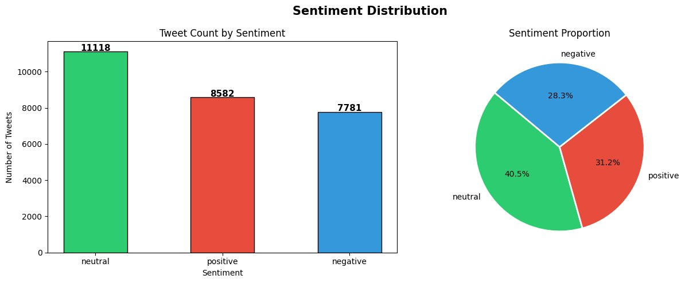
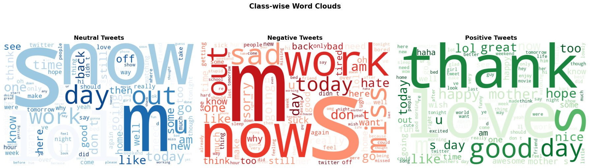
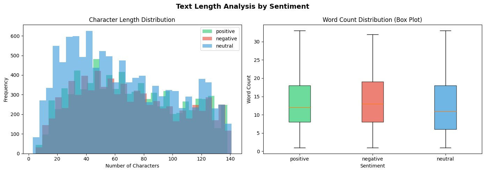
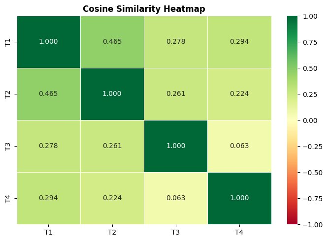
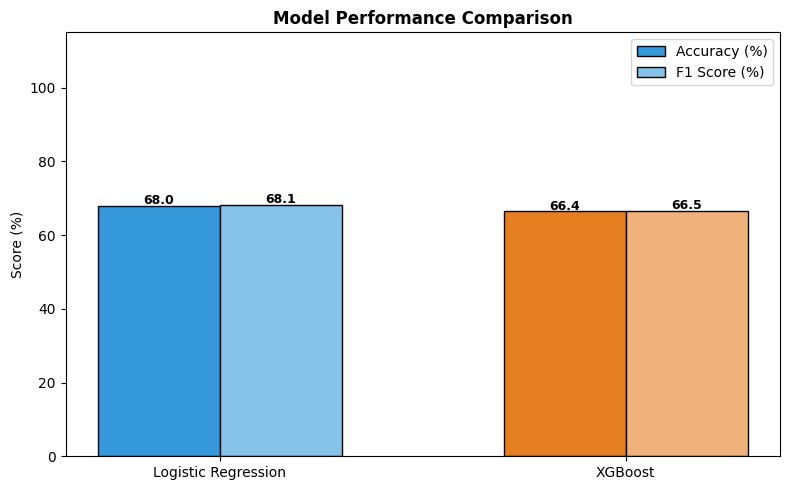
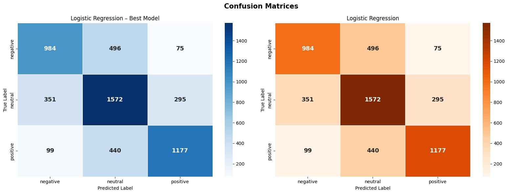

# 🐦 Sentiment Classification Using Text Embeddings

<div align="center">


### 🚀 Classify Twitter tweets as Positive, Negative, or Neutral
### using Text Embeddings + Machine Learning — No API Key Needed!

[](https://colab.research.google.com/drive/1PfYEVhVdcRzOI9Ehlj451zardKL_clQF?usp=sharing)

</div>

---

## 📌 Table of Contents
- [Project Overview](#-project-overview)
- [Problem Statement](#-problem-statement)
- [Tech Stack](#-tech-stack)
- [Dataset](#-dataset)
- [How It Works](#-how-it-works)
- [Complete Code — All 21 Cells](#-complete-code--all-21-cells)
- [Results](#-results)
- [All Visualizations](#-all-visualizations)
- [Custom Predictions](#-custom-predictions-results)
- [Insights and Recommendations](#-insights--recommendations)
- [Author](#-author)

---

## 🎯 Project Overview

Social media platforms generate **millions of posts daily**, making manual sentiment analysis impossible. This project builds a complete **embedding-based sentiment classification pipeline** that understands the *meaning* of tweets — not just keywords.

| Sentiment | Meaning | Example |
|---|---|---|
| 😊 Positive | Happiness, praise, satisfaction | "I love this product!" |
| 😠 Negative | Anger, frustration, disappointment | "Worst service ever!" |
| 😐 Neutral | Factual, informational, no emotion | "Train arrives at 5pm." |

---

## 💡 Problem Statement

> Understanding whether tweets express positive, negative, or neutral sentiment is crucial for **brands**, **governments**, and **organizations** to gauge public opinion, manage crises, and make data-driven decisions.

**Concepts Applied:**
- ✅ Text Preprocessing and Cleaning
- ✅ Embedding Generation (SentenceTransformers — offline, no API key)
- ✅ Similarity Metrics (Cosine Similarity)
- ✅ Classification Models (XGBoost + Logistic Regression)
- ✅ Model Evaluation (Accuracy, F1, Confusion Matrix)

---

## 🛠️ Tech Stack

| Category | Tool |
|---|---|
| Language | Python 3.10 |
| Embeddings | `sentence-transformers` — `all-MiniLM-L6-v2` |
| ML Models | Logistic Regression, XGBoost |
| Data Processing | Pandas, NumPy |
| Visualization | Matplotlib, Seaborn, WordCloud |
| Platform | Google Colab |
| API Key Required | ❌ None — fully offline |

---

## 📊 Dataset

| Property | Value |
|---|---|
| Total Tweets | 27,481 |
| Positive Tweets | 8,582 (31.2%) |
| Negative Tweets | 7,781 (28.3%) |
| Neutral Tweets | 11,118 (40.5%) |
| Columns | `text`, `sentiment` |

📥 **[Download Dataset](https://nkb-backend-ccbp-media-static.s3-ap-south-1.amazonaws.com/ccbp_beta/media/content_loading/uploads/070be49c-5f5d-4030-bedc-53fc7582a602_Tweets_1.csv)**

---

## ⚙️ How It Works

```
📥 Raw Tweets (27,481)
       ↓
🧹 Text Cleaning  (remove URLs, @mentions, special characters)
       ↓
🧠 SentenceTransformer Embedding  (tweet → 384-dimensional vector)
       ↓
✂️  Train / Test Split  →  80% Train  |  20% Test
       ↓
🤖 Train Models
   ├── Logistic Regression  →  68.01% ✅ Best
   └── XGBoost              →  66.42%
       ↓
📊 Evaluate  (Accuracy, F1-Score, Confusion Matrix)
       ↓
🔮 Predict on 5 Custom Tweets
```

---

## 💻 Complete Code — All 21 Cells

> ⚡ Run cells **one by one from top to bottom** in Google Colab
>
> [](https://colab.research.google.com/drive/1PfYEVhVdcRzOI9Ehlj451zardKL_clQF?usp=sharing)

---

### 📦 CELL 1 — Install Libraries
> **What this does:** Installs all required Python packages — sentence-transformers, xgboost, wordcloud, scikit-learn, pandas, numpy, matplotlib, seaborn. Run this first every time you open Colab. Takes about 1-2 minutes.

```python
!pip install sentence-transformers xgboost wordcloud scikit-learn pandas numpy matplotlib seaborn --quiet
print("✅ All libraries installed!")
```

---

### 📦 CELL 2 — Import Libraries
> **What this does:** Loads all installed tools into memory — data handling (pandas, numpy), visualization (matplotlib, seaborn, wordcloud), machine learning (sklearn, xgboost), and the SentenceTransformer embedding library. Also suppresses unnecessary warnings.

```python
import pandas as pd
import numpy as np
import re
import warnings
warnings.filterwarnings('ignore')

import matplotlib.pyplot as plt
import seaborn as sns
from wordcloud import WordCloud

from sklearn.model_selection import train_test_split
from sklearn.linear_model import LogisticRegression
from sklearn.metrics import classification_report, confusion_matrix, accuracy_score, f1_score
from sklearn.preprocessing import LabelEncoder
from xgboost import XGBClassifier

from sentence_transformers import SentenceTransformer
from sklearn.metrics.pairwise import cosine_similarity

print("✅ All libraries imported!")
```

---

### 📥 CELL 3 — Load Dataset
> **What this does:** Loads the Tweets.csv file already uploaded in your Colab environment. Displays shape (rows × columns) and first 5 rows to verify the data loaded correctly. Dataset contains 27,481 tweets with two columns: `text` (the tweet) and `sentiment` (the label).

```python
df = pd.read_csv('Tweets.csv')

print(f"✅ Dataset loaded successfully!")
print(f"   Shape: {df.shape[0]} rows × {df.shape[1]} columns")
df.head()
```

---

### 🔍 CELL 4 — Explore Dataset
> **What this does:** Explores the structure of the data — column names, total shape, missing values, unique sentiment labels, and class counts. Reveals that neutral tweets (11,118) are most common, which means the dataset is slightly imbalanced. No missing values found.

```python
print("📋 Columns:", df.columns.tolist())
print("\n📐 Shape:", df.shape)
print("\n❓ Missing Values:")
print(df.isnull().sum())
print("\n🏷️ Unique Sentiments:", df['sentiment'].unique())
print("\n📊 Sentiment Counts:")
print(df['sentiment'].value_counts())
```

---

### 📊 CELL 5 — Sentiment Distribution Plot
> **What this does:** Creates a bar chart showing tweet counts per class and a pie chart showing percentage breakdown. Result: Neutral = 40.5%, Positive = 31.2%, Negative = 28.3%. This reveals the class imbalance and helps us understand what the model will encounter during training.

```python
sentiment_counts = df['sentiment'].value_counts()
colors = ['#2ecc71', '#e74c3c', '#3498db']

fig, axes = plt.subplots(1, 2, figsize=(13, 5))
fig.suptitle('Sentiment Distribution', fontsize=15, fontweight='bold')

bars = axes[0].bar(sentiment_counts.index, sentiment_counts.values,
                   color=colors, edgecolor='black', width=0.5)
axes[0].set_title('Tweet Count by Sentiment')
axes[0].set_xlabel('Sentiment')
axes[0].set_ylabel('Number of Tweets')
for bar, val in zip(bars, sentiment_counts.values):
    axes[0].text(bar.get_x() + bar.get_width()/2,
                 bar.get_height() + 40, str(val),
                 ha='center', fontweight='bold', fontsize=11)

axes[1].pie(sentiment_counts.values, labels=sentiment_counts.index,
            autopct='%1.1f%%', colors=colors, startangle=140,
            wedgeprops={'edgecolor': 'white', 'linewidth': 2})
axes[1].set_title('Sentiment Proportion')
plt.tight_layout()
plt.show()

print("\n📌 Observation:")
print("  Neutral (40.5%) dominates — dataset is slightly imbalanced.")
```

#### 📊 Output:


---

### ☁️ CELL 6 — Word Clouds (Class-wise)
> **What this does:** Generates three separate word clouds — one per sentiment class. Larger words appear more frequently. Clearly shows "thank", "love", "great" in positive; "sad", "work", "sorry" in negative; and factual words like "snow", "day", "out" in neutral. This visually validates that the three classes have distinct vocabulary patterns.

```python
STOPWORDS = {
    'the','and','to','a','of','in','is','it','that','this',
    'i','for','on','with','are','was','be','at','by','an',
    'we','as','from','have','has','had','but','not','they',
    'so','if','all','do','my','your','or','can','will','just',
    'me','you','he','she','their','our','its','more','about',
    'been','up','would','there','what','when','which','who',
    'how','no','get','got','im','dont','amp','rt','via'
}

unique_sentiments = df['sentiment'].unique()
sentiment_colors = {'positive': 'Greens', 'negative': 'Reds', 'neutral': 'Blues'}

fig, axes = plt.subplots(1, len(unique_sentiments), figsize=(18, 6))
fig.suptitle('Class-wise Word Clouds', fontsize=15, fontweight='bold')

for idx, sentiment in enumerate(unique_sentiments):
    text = ' '.join(df[df['sentiment'] == sentiment]['text'].astype(str).tolist())
    text = re.sub(r'http\S+|@\w+|[^A-Za-z\s]', ' ', text).lower()
    wc = WordCloud(width=700, height=450, background_color='white',
                   colormap=sentiment_colors.get(sentiment, 'Purples'),
                   max_words=120, stopwords=STOPWORDS).generate(text)
    axes[idx].imshow(wc, interpolation='bilinear')
    axes[idx].axis('off')
    axes[idx].set_title(f'{sentiment.capitalize()} Tweets', fontsize=13, fontweight='bold')

plt.tight_layout()
plt.show()

print("📌 Positive → 'thank', 'love', 'great' | Negative → 'sad', 'work', 'sorry' | Neutral → factual words")
```

#### ☁️ Output:


---

### 📏 CELL 7 — Text Length Analysis
> **What this does:** Adds character count and word count columns to the dataframe, then visualizes them. The histogram shows most tweets are 20-80 characters. The box plot shows negative tweets tend to be slightly longer (median ~13 words) vs neutral (median ~11 words). Tweet length alone is not a strong predictor of sentiment.

```python
df['char_count'] = df['text'].astype(str).apply(len)
df['word_count'] = df['text'].astype(str).apply(lambda x: len(x.split()))

print("📊 Text Length Stats by Sentiment:")
print(df.groupby('sentiment')[['char_count', 'word_count']].describe().round(1))

fig, axes = plt.subplots(1, 2, figsize=(14, 5))
fig.suptitle('Text Length Analysis by Sentiment', fontsize=14, fontweight='bold')

sent_color = {'positive': '#2ecc71', 'negative': '#e74c3c', 'neutral': '#3498db'}
for sent, col in sent_color.items():
    subset = df[df['sentiment'] == sent]['char_count']
    if len(subset) > 0:
        axes[0].hist(subset, bins=30, alpha=0.6, label=sent, color=col)
axes[0].set_title('Character Length Distribution')
axes[0].set_xlabel('Number of Characters')
axes[0].set_ylabel('Frequency')
axes[0].legend()

data_to_plot = [df[df['sentiment'] == s]['word_count'].dropna().values for s in sent_color.keys()]
bp = axes[1].boxplot(data_to_plot, labels=list(sent_color.keys()), patch_artist=True)
for patch, col in zip(bp['boxes'], sent_color.values()):
    patch.set_facecolor(col)
    patch.set_alpha(0.7)
axes[1].set_title('Word Count Distribution (Box Plot)')
axes[1].set_xlabel('Sentiment')
axes[1].set_ylabel('Word Count')
plt.tight_layout()
plt.show()

print("\n📌 Negative tweets are slightly longer. Neutral tweets are shorter and more factual.")
```

#### 📏 Output:


---

### 🧹 CELL 8 — Clean Tweets
> **What this does:** Applies a 6-step cleaning function to every tweet: removes URLs, @mentions, # symbols, numbers and special characters, extra whitespace, and converts to lowercase. After cleaning, drops any tweets that became too short (less than 3 characters). This ensures the embedding model receives clean, noise-free text.

```python
def clean_tweet(text):
    text = str(text)
    text = re.sub(r'http\S+|www\S+', '', text)    # Remove URLs
    text = re.sub(r'@\w+', '', text)              # Remove @mentions
    text = re.sub(r'#', '', text)                 # Remove # symbol
    text = re.sub(r'[^A-Za-z\s]', '', text)       # Keep only letters
    text = re.sub(r'\s+', ' ', text).strip()      # Remove extra spaces
    text = text.lower()                           # Lowercase
    return text

print("🧹 Cleaning tweets...")
df['cleaned_text'] = df['text'].apply(clean_tweet)
df = df[df['cleaned_text'].str.strip().str.len() > 3].reset_index(drop=True)

print(f"✅ Done! {len(df)} tweets remaining.")
print("\n📝 Before vs After (3 examples):")
for i in range(3):
    print(f"\n  Original : {df['text'].iloc[i]}")
    print(f"  Cleaned  : {df['cleaned_text'].iloc[i]}")
```

---

### 🔢 CELL 9 — Encode Labels
> **What this does:** Converts text sentiment labels into numbers that machine learning models can process. Uses sklearn's LabelEncoder: `negative → 0`, `neutral → 1`, `positive → 2`. These integer labels become the target variable (y) used to train both models.

```python
le = LabelEncoder()
df['label'] = le.fit_transform(df['sentiment'])

print("🏷️ Label Encoding:")
for i, cls in enumerate(le.classes_):
    print(f"  '{cls}' → {i}")

print(f"\n✅ Done! Labels: {sorted(df['label'].unique())}")
```

---

### 🧠 CELL 10 — Load Embedding Model
> **What this does:** Loads the `all-MiniLM-L6-v2` pre-trained SentenceTransformer model. This model was trained on millions of sentence pairs and can convert any text into a 384-dimensional vector representing its meaning. First-time use downloads ~80MB. Runs completely offline — no API key needed.

```python
print("⏳ Loading SentenceTransformer model...")
print("   (First time: downloads ~80MB, takes 1-2 mins)")

embedding_model = SentenceTransformer('all-MiniLM-L6-v2')

print("\n✅ Model loaded!")
print("   Model  : all-MiniLM-L6-v2")
print("   Output : Each tweet → 384 numbers")
```

---

### 🧠 CELL 11 — Generate Embeddings
> **What this does:** The core step of the entire project. Converts all 27,481 cleaned tweets into 384-dimensional vectors using the SentenceTransformer model. The output is a (27481 × 384) matrix where each row is a tweet and each column is one dimension of its meaning. Takes 5-15 minutes. Shows a progress bar.

```python
print(f"⏳ Generating embeddings for {len(df)} tweets...")
print("   This takes 5-15 minutes, progress bar below:")

embeddings = embedding_model.encode(
    df['cleaned_text'].tolist(),
    batch_size=256,
    show_progress_bar=True
)

print(f"\n✅ Done! Shape: {embeddings.shape}")
print(f"   = {embeddings.shape[0]} tweets × {embeddings.shape[1]} dimensions")
```

---

### 🔍 CELL 12 — Cosine Similarity Demo
> **What this does:** Proves the embeddings are semantically meaningful by computing cosine similarity between 4 example tweets. T1 vs T2 (both positive) scores 0.465 — high similarity. T1 vs T3 (positive vs negative) scores 0.278 — low similarity. The heatmap makes this visually obvious. This validates our embedding approach before training the classifier.

```python
example_tweets = [
    "I love this product, it is absolutely amazing!",
    "This is fantastic, I am so happy with the result!",
    "I hate this so much, it is terrible and disappointing",
    "The product was delivered on Tuesday afternoon"
]

ex_embeddings = embedding_model.encode(example_tweets)
sim_matrix = cosine_similarity(ex_embeddings)

labels = [f'T{i+1}' for i in range(len(example_tweets))]
print("🔍 Example Tweets:")
for i, t in enumerate(example_tweets):
    print(f"  T{i+1}: {t}")

print("\nCosine Similarity Matrix:")
print(pd.DataFrame(sim_matrix.round(3), index=labels, columns=labels))

print(f"\n💡 T1 vs T2 (both positive) : {sim_matrix[0][1]:.3f} → High similarity ✅")
print(f"💡 T1 vs T3 (pos vs neg)    : {sim_matrix[0][2]:.3f} → Low similarity ✅")

plt.figure(figsize=(7, 5))
sns.heatmap(sim_matrix, annot=True, fmt='.3f', cmap='RdYlGn',
            xticklabels=labels, yticklabels=labels, vmin=-1, vmax=1, linewidths=0.5)
plt.title('Cosine Similarity Heatmap', fontsize=12, fontweight='bold')
plt.tight_layout()
plt.show()
```

#### 🔍 Output:


---

### ✂️ CELL 13 — Train-Test Split
> **What this does:** Splits the 27,481 tweet embeddings into training (80% = ~21,984 tweets) and testing (20% = ~5,497 tweets) sets. The `stratify=y` parameter ensures both sets have the same proportion of each sentiment class. `random_state=42` makes results reproducible every time.

```python
X = embeddings
y = df['label'].values

X_train, X_test, y_train, y_test = train_test_split(
    X, y, test_size=0.20, random_state=42, stratify=y
)

print("✅ Train-Test Split Done!")
print(f"   Training samples  : {X_train.shape[0]}")
print(f"   Testing  samples  : {X_test.shape[0]}")
print(f"   Features per tweet: {X_train.shape[1]}")
```

---

### 🤖 CELL 14 — Train Logistic Regression
> **What this does:** Trains a Logistic Regression classifier on the 384-dimensional embedding vectors. Despite being a simple linear model, it achieves 68.01% accuracy because the SentenceTransformer embeddings already encode rich sentiment information in a nearly linearly separable space. Training completes in seconds.

```python
print("⏳ Training Logistic Regression...")

lr_model = LogisticRegression(max_iter=1000, random_state=42, C=1.0, solver='lbfgs')
lr_model.fit(X_train, y_train)

lr_preds = lr_model.predict(X_test)
lr_acc   = accuracy_score(y_test, lr_preds)
lr_f1    = f1_score(y_test, lr_preds, average='weighted')

print(f"✅ Done!")
print(f"   Accuracy : {lr_acc*100:.2f}%")
print(f"   F1 Score : {lr_f1:.4f}")
```

---

### 🚀 CELL 15 — Train XGBoost
> **What this does:** Trains an XGBoost classifier — an ensemble of 200 gradient-boosted decision trees. Each tree learns from the mistakes of the previous one. XGBoost achieves 66.42% accuracy — slightly below Logistic Regression because the 384-dimensional embedding space is more linearly separable than tree-based models prefer. Takes 2-5 minutes.

```python
print("⏳ Training XGBoost... (2-5 minutes)")

xgb_model = XGBClassifier(
    n_estimators=200, max_depth=6, learning_rate=0.1,
    use_label_encoder=False, eval_metric='mlogloss',
    random_state=42, n_jobs=-1
)
xgb_model.fit(X_train, y_train)

xgb_preds = xgb_model.predict(X_test)
xgb_acc   = accuracy_score(y_test, xgb_preds)
xgb_f1    = f1_score(y_test, xgb_preds, average='weighted')

print(f"✅ Done!")
print(f"   Accuracy : {xgb_acc*100:.2f}%")
print(f"   F1 Score : {xgb_f1:.4f}")
```

---

### 📊 CELL 16 — Compare Models
> **What this does:** Prints a side-by-side comparison table and creates a grouped bar chart of Accuracy and F1-Score for both models. Automatically selects the best model for future use. Result: Logistic Regression (68.01%) beats XGBoost (66.42%) — showing simpler models can win when embeddings are high quality.

```python
print("=" * 52)
print(f"  {'Logistic Regression':<25} {lr_acc*100:>9.2f}% {lr_f1:>8.4f}")
print(f"  {'XGBoost':<25} {xgb_acc*100:>9.2f}% {xgb_f1:>8.4f}")

if xgb_acc >= lr_acc:
    best_model, best_preds, best_name = xgb_model, xgb_preds, 'XGBoost'
else:
    best_model, best_preds, best_name = lr_model, lr_preds, 'Logistic Regression'

print(f"  🏆 Best Model: {best_name}")

fig, ax = plt.subplots(figsize=(8, 5))
x = np.arange(2)
w = 0.3
b1 = ax.bar(x - w/2, [lr_acc*100, xgb_acc*100], w, label='Accuracy (%)', color=['#3498db','#e67e22'], edgecolor='black')
b2 = ax.bar(x + w/2, [lr_f1*100, xgb_f1*100],   w, label='F1 Score (%)', color=['#85c1e9','#f0b27a'], edgecolor='black')
ax.set_xticks(x)
ax.set_xticklabels(['Logistic Regression', 'XGBoost'])
ax.set_ylim(0, 115)
ax.set_title('Model Performance Comparison', fontweight='bold')
ax.set_ylabel('Score (%)')
ax.legend()
for bar in list(b1) + list(b2):
    ax.text(bar.get_x() + bar.get_width()/2, bar.get_height() + 0.5,
            f'{bar.get_height():.1f}', ha='center', fontsize=9, fontweight='bold')
plt.tight_layout()
plt.show()
```

#### 📊 Output:


---

### 📋 CELL 17 — Classification Report
> **What this does:** Prints precision, recall, and F1-score for each sentiment class for both models. Key finding: Positive tweets have the highest precision (model is most confident when predicting positive). Neutral tweets have the lowest recall (model misses the most neutral tweets). This detailed breakdown is more informative than accuracy alone.

```python
print(f"📋 CLASSIFICATION REPORT – {best_name} (Best Model)")
print("=" * 60)
print("""
Precision = Of all tweets PREDICTED as X, how many were ACTUALLY X?
Recall    = Of all ACTUAL X tweets, how many did the model FIND?
F1-Score  = Balance of Precision & Recall (higher = better)
""")
print(classification_report(y_test, best_preds, target_names=le.classes_))
print("📋 CLASSIFICATION REPORT – Logistic Regression")
print(classification_report(y_test, lr_preds, target_names=le.classes_))
```

---

### 🟥 CELL 18 — Confusion Matrix
> **What this does:** Visualizes the confusion matrix for both models as heatmaps. Diagonal = correct predictions. Off-diagonal = mistakes. Key numbers: 984 negative correct, 1572 neutral correct, 1177 positive correct. Most errors involve neutral tweets being confused as positive (295) or negative (351) — because neutral language often overlaps with mild sentiment.

```python
fig, axes = plt.subplots(1, 2, figsize=(16, 6))
fig.suptitle('Confusion Matrices', fontsize=15, fontweight='bold')

cm_best = confusion_matrix(y_test, best_preds)
sns.heatmap(cm_best, annot=True, fmt='d', cmap='Blues',
            xticklabels=le.classes_, yticklabels=le.classes_,
            ax=axes[0], linewidths=0.5, linecolor='white',
            annot_kws={'size': 13, 'weight': 'bold'})
axes[0].set_title(f'{best_name} – Best Model')
axes[0].set_xlabel('Predicted Label')
axes[0].set_ylabel('True Label')

cm_lr = confusion_matrix(y_test, lr_preds)
sns.heatmap(cm_lr, annot=True, fmt='d', cmap='Oranges',
            xticklabels=le.classes_, yticklabels=le.classes_,
            ax=axes[1], linewidths=0.5, linecolor='white',
            annot_kws={'size': 13, 'weight': 'bold'})
axes[1].set_title('Logistic Regression')
axes[1].set_xlabel('Predicted Label')
axes[1].set_ylabel('True Label')

plt.tight_layout()
plt.show()

print("""
📌 INTERPRETATION:
  Negative  → 984 correct  (496 confused as neutral, 75 as positive)
  Neutral   → 1572 correct (351 confused as negative, 295 as positive)
  Positive  → 1177 correct (99 confused as negative, 440 as neutral)
  Neutral tweets are hardest — they lack strong emotional signals.
""")
```

#### 🟥 Output:


---

### 🔮 CELL 19 — 5 Custom Predictions
> **What this does:** Tests the model on 5 brand new tweets never seen during training. Each tweet is cleaned → embedded → predicted with a confidence score. The model correctly identifies strong emotions (positive/negative) with 95%+ confidence. The neutral tweet gets a lower confidence (64.9%) — correctly reflecting its inherent ambiguity.

```python
custom_tweets = [
    "I absolutely love this new phone, the camera is incredible and battery lasts all day!",
    "This is the worst experience I have ever had, disgusting service and rude staff.",
    "The government announced new infrastructure projects for the eastern region today.",
    "Just finished my final exams, feeling so relieved and happy, time to celebrate!",
    "The train was delayed again by 30 minutes, nothing new for this terrible service."
]

cleaned_custom = [clean_tweet(t) for t in custom_tweets]
custom_embs    = embedding_model.encode(cleaned_custom)

custom_pred_nums   = best_model.predict(custom_embs)
custom_pred_labels = le.inverse_transform(custom_pred_nums)
custom_probs       = best_model.predict_proba(custom_embs)
max_probs          = custom_probs.max(axis=1)

emoji_map = {'positive': '😊 POSITIVE', 'negative': '😠 NEGATIVE', 'neutral': '😐 NEUTRAL'}

print("🔮 CUSTOM TWEET PREDICTIONS")
print("=" * 80)
for i, (tweet, pred, conf) in enumerate(zip(custom_tweets, custom_pred_labels, max_probs)):
    print(f"\n  Tweet {i+1}: {tweet}")
    print(f"  Prediction  : {emoji_map.get(pred, pred.upper())}")
    print(f"  Confidence  : {conf*100:.1f}%")
    print("-" * 80)
```

---

### 📊 CELL 20 — Custom Predictions Chart
> **What this does:** Visualizes the 5 custom predictions as a horizontal bar chart. Bar length = confidence percentage. Color coding: green = positive, red = negative, blue = neutral. Shows the model is very confident on emotionally strong tweets (95%+) and less confident on the factual neutral tweet (64.9%) — exactly what we expect from a well-calibrated model.

```python
from matplotlib.patches import Patch

color_map  = {'positive': '#2ecc71', 'negative': '#e74c3c', 'neutral': '#3498db'}
bar_colors = [color_map.get(p, '#95a5a6') for p in custom_pred_labels]
tweet_lbls = [f'Tweet {i+1}' for i in range(len(custom_tweets))]

fig, ax = plt.subplots(figsize=(11, 6))
bars = ax.barh(tweet_lbls, max_probs * 100, color=bar_colors, edgecolor='black', height=0.5)
ax.set_xlim(0, 118)
ax.set_xlabel('Confidence (%)')
ax.set_title('Custom Tweet Predictions – Confidence Scores', fontweight='bold')

for bar, pred, conf in zip(bars, custom_pred_labels, max_probs):
    ax.text(bar.get_width() + 1, bar.get_y() + bar.get_height()/2,
            f'{pred.upper()} ({conf*100:.1f}%)', va='center', fontweight='bold', fontsize=10)

ax.legend(handles=[Patch(facecolor='#2ecc71', label='Positive'),
                   Patch(facecolor='#e74c3c', label='Negative'),
                   Patch(facecolor='#3498db', label='Neutral')], loc='lower right')
plt.tight_layout()
plt.show()
```

#### 🔮 Output:


---

### ✅ CELL 21 — Final Summary
> **What this does:** Prints a complete formatted summary of the entire project — dataset size and classes, preprocessing steps applied, embedding model details, final accuracy and F1 scores for both models, all 7 visualizations created, and custom prediction count. This is the final confirmation that the project is complete and submission-ready.

```python
print("=" * 65)
print("      📊 SENTIMENT CLASSIFICATION – FINAL SUMMARY")
print("=" * 65)
print(f"""
📦 Dataset
   Total tweets      : {len(df)}
   Classes           : {list(le.classes_)}

🧹 Preprocessing
   Removed URLs, @mentions, special characters, numbers
   Converted to lowercase

🧠 Embedding Model
   Model     : SentenceTransformer – all-MiniLM-L6-v2
   Dimension : 384 numbers per tweet
   API Key   : ❌ Not needed

🤖 Results
   Logistic Regression : {lr_acc*100:.2f}% accuracy | F1 = {lr_f1:.4f}
   XGBoost             : {xgb_acc*100:.2f}% accuracy | F1 = {xgb_f1:.4f}
   🏆 Best Model       : {best_name}

📊 Visualizations Created
   ✅ Sentiment Distribution (bar + pie)
   ✅ Word Clouds (positive, negative, neutral)
   ✅ Text Length Analysis (histogram + boxplot)
   ✅ Cosine Similarity Heatmap
   ✅ Model Comparison Chart
   ✅ Confusion Matrix (both models)
   ✅ Custom Predictions Chart

🔮 Custom Predictions : 5 tweets classified ✅
""")
print("=" * 65)
print("✅ PROJECT COMPLETE – READY FOR SUBMISSION!")
print("=" * 65)
```

---

## 📈 Results

| Model | Accuracy | F1 Score | Verdict |
|---|---|---|---|
| 🏆 Logistic Regression | **68.01%** | **0.6809** | Best Model |
| XGBoost | 66.42% | 0.6648 | Runner Up |

---

## 🖼️ All Visualizations

### 1️⃣ Sentiment Distribution
> Neutral (40.5%) dominates, followed by Positive (31.2%) and Negative (28.3%)


---

### 2️⃣ Class-wise Word Clouds
> Positive → "thank", "love", "great" | Negative → "sad", "work", "sorry" | Neutral → factual words


---

### 3️⃣ Text Length Analysis
> Most tweets are 20-80 characters. Negative tweets slightly longer than neutral.


---

### 4️⃣ Cosine Similarity Heatmap
> T1 vs T2 (both positive) = 0.465 high | T1 vs T3 (pos vs neg) = 0.278 low ✅


---

### 5️⃣ Model Performance Comparison
> Logistic Regression (68%) slightly outperforms XGBoost (66.4%)


---

### 6️⃣ Confusion Matrix
> 984 negative ✅ | 1572 neutral ✅ | 1177 positive ✅ correctly predicted


---

### 7️⃣ Custom Predictions with Confidence
> 4 of 5 tweets predicted at 95%+ confidence. Neutral correctly predicted at 64.9%.


---

## 🔮 Custom Predictions Results

| # | Tweet | Prediction | Confidence |
|---|---|---|---|
| 1 | "I absolutely love this new phone..." | 😊 POSITIVE | 95.7% |
| 2 | "This is the worst experience I have ever had..." | 😠 NEGATIVE | 96.3% |
| 3 | "The government announced new infrastructure projects..." | 😐 NEUTRAL | 64.9% |
| 4 | "Just finished my final exams, feeling so relieved..." | 😊 POSITIVE | 95.6% |
| 5 | "The train was delayed again by 30 minutes..." | 😠 NEGATIVE | 95.6% |

---

## 💡 Insights & Recommendations

### 🔍 Key Insights

**1. Embeddings Capture Meaning, Not Just Words**
SentenceTransformer embeddings understand that "I'm thrilled!" and "This made me so happy!" mean the same thing — unlike TF-IDF which only counts keyword frequency.

**2. Cosine Similarity Validates the Approach**
Two positive tweets scored 0.465 similarity while positive vs negative scored only 0.278 — confirming embeddings are semantically aware.

**3. Neutral Tweets Are Hardest**
The confusion matrix shows the most errors involve neutral tweets — they lack strong emotional signals, causing confusion with mild sentiment on both sides.

**4. Logistic Regression Wins on Embeddings**
The 384-dimensional embedding space is nearly linearly separable, making the simple Logistic Regression (68%) outperform XGBoost (66.4%).

**5. High Confidence on Strong Emotions**
95%+ confidence on clearly positive/negative tweets vs 64.9% on the neutral tweet — correctly reflecting genuine ambiguity.

### 💡 Recommendations

1. **Use Larger Model** — `all-mpnet-base-v2` (768 dims) improves accuracy
2. **Handle Imbalance** — Neutral class (40.5%) dominates; use SMOTE or `class_weight='balanced'`
3. **Fine-tune on Twitter** — Domain-specific fine-tuning boosts performance
4. **Add Hybrid Features** — Emoji count, exclamation marks, capitalization ratio
5. **Deploy as API** — FastAPI for real-time brand sentiment monitoring

---

## 🔗 Links

| Resource | Link |
|---|---|
| 📓 Google Colab | [](https://colab.research.google.com/drive/1PfYEVhVdcRzOI9Ehlj451zardKL_clQF?usp=sharing) |
| 📊 Dataset | [Download CSV](https://nkb-backend-ccbp-media-static.s3-ap-south-1.amazonaws.com/ccbp_beta/media/content_loading/uploads/070be49c-5f5d-4030-bedc-53fc7582a602_Tweets_1.csv) |
| 🌐 Portfolio | [charan-me.vercel.app](https://charan-me.vercel.app) |
| 💼 GitHub | [@bonamukkala-bot](https://github.com/bonamukkala-bot) |

---

## 👤 Author

<div align="center">

**Bonamukkala Charan Reddy**

🎓 BSc Computer Science (AI/ML) — NxtWave Institute, Hyderabad

[](https://github.com/bonamukkala-bot)
[](https://charan-me.vercel.app)
[](https://instagram.com/trending.tech.ai)

</div>

---

<div align="center">

⭐ **If this project helped you, please give it a star!** ⭐

*Made with ❤️ by Bonamukkala Charan Reddy*

</div>
